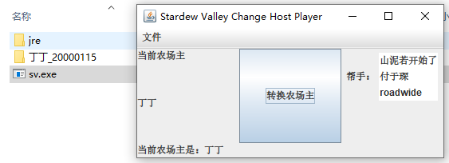

# StardewValleyTool

本工具可以用来转换星露谷物语的农场主，也就是改变服务器玩家。因为存档只存在于农场主的电脑上，其他玩家无法单独打开，只能在和房主联机时才能玩。但如果拷贝房主的存档又只能用房主那个人物，无法用自己的人物。本工具就解决了这个问题，将房主的存档进行转换，把自己的角色变成房主，这样就能自己单独打开自己角色的存档。

------

This tool can be used to change the farmer of Stardew Valley, which is to change server players. Because the archive only exists on the farmer ’s computer, other players cannot open it separately, and can only play it when connected to the host. But if you copy the owner ’s archive, you can only use the character of the owner, not your own character. This tool solves this problem, converts the homeowner's archive, and turns his character into a homeowner, so that he can open his own archive of his own character.

## 使用方法/Instructions

导入存档文件夹，可以是房主操作然后将结果给你，也可以让房主把存档发给你。然后选择选转换的角色，点击中间那个很大的“转换农场主”按钮，就会生成一个新的存档文件夹。将该文件夹移入星露谷物语的存档文件夹（如果是windows的话，是在下面这个文件夹）

```
%appdata%\StardewValley\Saves
```

------

Importing the archive folder can be done by the homeowner and give you the result, or you can let the homeowner send you the archive. Then select the character to be converted, click the big "Convert Farmer" button in the middle, and a new archive folder will be generated. Move this folder to the archive folder of Stardew Valley(if it is windows, it is the folder below)

## 运行截图/ScreenShot

